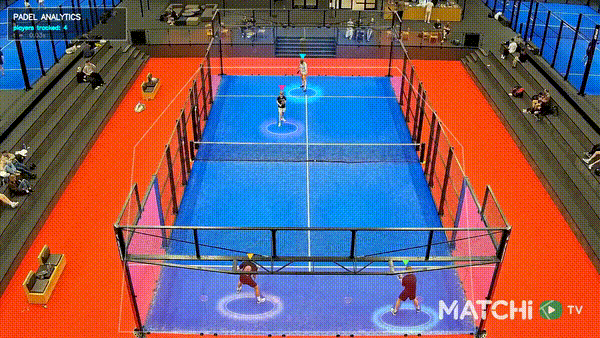
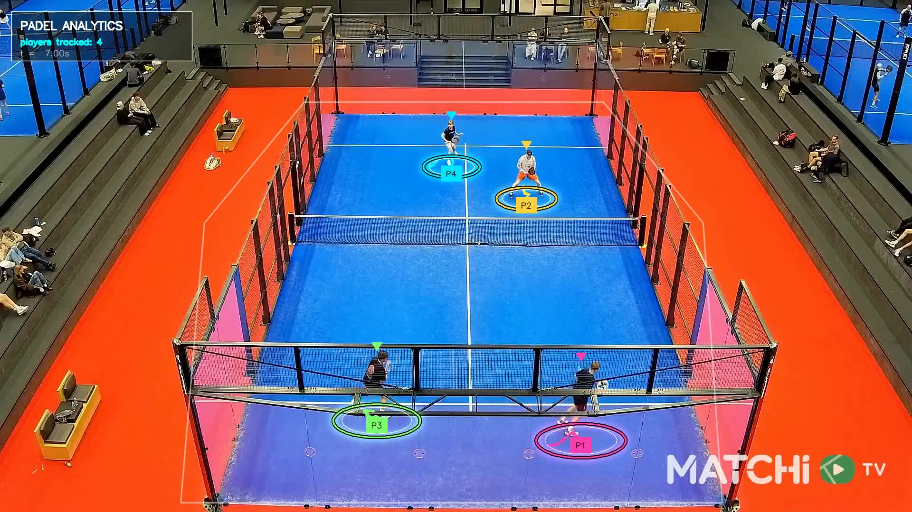
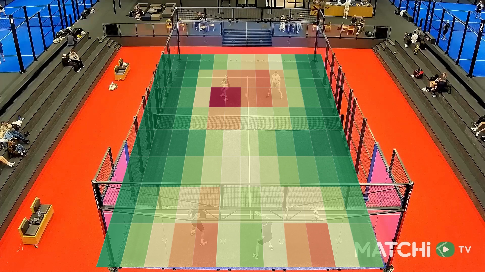

<div align="center">

# 🎾 Padel Vision

**Turn a raw padel clip into a broadcast-grade analytics film — AR player rings, live court heatmaps, and players composited into the scene, all in one notebook.**

[](https://colab.research.google.com/github/nassim/padel-vision/blob/main/notebooks/tutorials/padel_vision_v1.ipynb)
[](https://www.python.org/)
[](https://github.com/roboflow/rf-detr)
[](https://github.com/ifzhang/ByteTrack)
[](https://github.com/roboflow/supervision)
[](LICENSE)



</div>

---

## 📌 What is this?

A computer-vision pipeline that turns a single padel match clip into a polished, **TV-broadcast-style**
overlay: every player wrapped in a perspective-correct **AR ground ring**, a live **zonal heatmap**
of where they move, and the players themselves **composited in front** of the graphics so it looks
painted into the scene.

It's a **self-contained notebook** — open it on **[Google Colab](https://colab.research.google.com/github/nassim/padel-vision/blob/main/notebooks/tutorials/padel_vision_v1.ipynb)**, upload your own clip, run top to bottom. No local setup required.

<div align="center">


</div>

## ✨ What it does

From one video, the notebook builds — step by step:

1. **Detect** every person with **RF-DETR** (transformer detector, no NMS).
2. **Isolate the court** with a homography-backed region filter — keep the 4 players, drop the crowd.
3. **Track** them with **ByteTrack**, then **EMA-smooth + coast through occlusions** so IDs and rings stay rock-steady.
4. **AR ground rings** — a constant-radius circle projected onto the court plane (tilt / yaw / roll + perspective), with a soft glow and the player's legs passing *through* the ring.
5. **Interactive court picker** — drag 4 corners (`ipywidgets`) to fit the homography to *any* clip.
6. **Zonal heatmap** — the court split into perspective cells, shaded green→red by occupancy, FIFA-style.
7. **Players in front** — a **YOLO11-seg** matte re-pastes the real players on top of every overlay.
8. **The final cut** — the full clip with the live heatmap + rings together, and timed, smooth transitions.

## 🧱 Tech stack

| Area | Tools |
|------|-------|
| Detection | [RF-DETR](https://github.com/roboflow/rf-detr) (players) |
| Tracking | [ByteTrack](https://github.com/ifzhang/ByteTrack) + custom EMA / occlusion-coast stabilizer |
| Segmentation | [Ultralytics YOLO11-seg](https://github.com/ultralytics/ultralytics) (foreground matte) |
| Geometry | OpenCV homography (court ↔ image), perspective-projected AR rings |
| CV / drawing | [Supervision](https://github.com/roboflow/supervision), OpenCV, NumPy, ffmpeg |
| Notebook UX | Jupyter, ipywidgets, Matplotlib |

## 🧩 Two ways to use it

- **📓 Tutorial notebooks** (`notebooks/tutorials/`) — self-contained, step-by-step walkthroughs that
  build the whole effect. The flagship is `padel_vision_v1.ipynb`; future iterations land as `_v2`, `_v3`.
- **📦 `padel-vision` package + CLI** — an installable library (`pip install -e .`) with reusable pieces
  (detection, court geometry, video I/O) behind a [Fire](https://github.com/google/python-fire) CLI.

## 🚀 Quickstart

### The notebook on Google Colab (easiest)

1. **[Open the flagship notebook in Colab](https://colab.research.google.com/github/nassim/padel-vision/blob/main/notebooks/tutorials/padel_vision_v1.ipynb)**.
2. **Runtime → Change runtime type → GPU**.
3. Run the **Setup** cell (installs deps), then upload your clip when prompted, and run top to bottom.

### Locally

```bash
python3 -m venv .venv && source .venv/bin/activate
pip install torch torchvision --index-url https://download.pytorch.org/whl/cu121  # match your CUDA
pip install -e ".[notebook]"      # the padel-vision package + notebook deps

jupyter lab notebooks/tutorials/padel_vision_v1.ipynb
```

Drop a clip in `data/raw/` (or let the notebook prompt you), set your court corners (see below), and
run the cells. Outputs land in `data/processed/`.

### The CLI

```bash
# pick the 4 court corners on a frame and save them (interactive OpenCV window)
padel-vision court adjust data/raw/match.mp4 --output notebooks/tutorials/court_corners.txt
```

> 💡 The court geometry is clip-specific — set it once with `padel-vision court adjust` (or the **Step 1
> corner picker** inside the notebook) before rendering.

## 🛠️ How it works (a few highlights)

- **Perspective AR rings** — instead of a flat ellipse, a real circle is laid on the ground plane and
  projected through tilt/yaw/roll + a perspective divide, so rings sit *on the court* and shrink with distance.
- **Court homography** — 4 picked corners map the court to a unit square; the heatmap grid is tiled in
  that space and projected back, so cells follow the court's perspective.
- **True-colour heatmap over a colourful court** — the court is desaturated under the grid first, so
  green→red reads true instead of muddying over the blue/orange surface.
- **Foreground compositing** — a segmentation matte of the on-court players re-pastes their pixels on
  top of the overlays (`overlay·(1-mask) + frame·mask`) for an in-scene, AR feel.
- **Stable, fast rendering** — tracks are EMA-smoothed and coasted through dropped frames; the heavy
  models run every *N*th frame (configurable) to keep render time down.

## 🔭 Roadmap

- [x] **Object detection** — players via RF-DETR
- [x] **Multi-object tracking** — persistent IDs (ByteTrack + stabilizer)
- [x] **Court geometry** — homography from a 4-corner picker
- [x] **AR player rings** — perspective-projected, broadcast-style
- [x] **Movement heatmaps** — FIFA-style zonal grid, live-updating
- [x] **Foreground compositing** — players in front via segmentation
- [x] **Final film** — full-clip render with timed transitions
- [ ] **Top-down minimap** + real-metre distances/speeds
- [ ] **Ball detection & analytics** — dedicated small-object model, trajectory & speed
- [ ] **Shot/event detection** — bandeja, víbora, smash, volley
- [ ] **Match stats dashboard**

## 📂 Project structure

```
padel-vision/
├── notebooks/tutorials/
│   ├── padel_vision_v1.ipynb   # ⭐ the flagship, self-contained tutorial
│   ├── 01_object_detection.ipynb
│   └── court_corners.txt         # saved court calibration
├── src/padel_vision/                 # the installable package
│   ├── cli.py                    # Fire CLI: `padel-vision ...`
│   ├── court/                    # court-corner picker (homography ROI)
│   ├── detection/                # RF-DETR / YOLO detector + annotators
│   ├── video/                    # video I/O helpers
│   └── config.py
├── scripts/render_reel.py        # standalone reel renderer
├── data/{raw,processed}/         # clips in / results out (gitignored)
├── tests/                        # unit tests
└── docs/                         # README assets
```

## 🤝 Acknowledgements

Built on the excellent open-source work of [Roboflow RF-DETR](https://github.com/roboflow/rf-detr),
[Ultralytics](https://github.com/ultralytics/ultralytics), [Roboflow Supervision](https://github.com/roboflow/supervision)
and [ByteTrack](https://github.com/ifzhang/ByteTrack).

## 📄 License

[MIT](LICENSE) © 2026 Nassim
