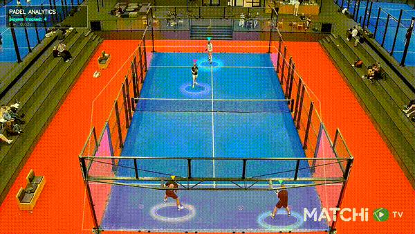
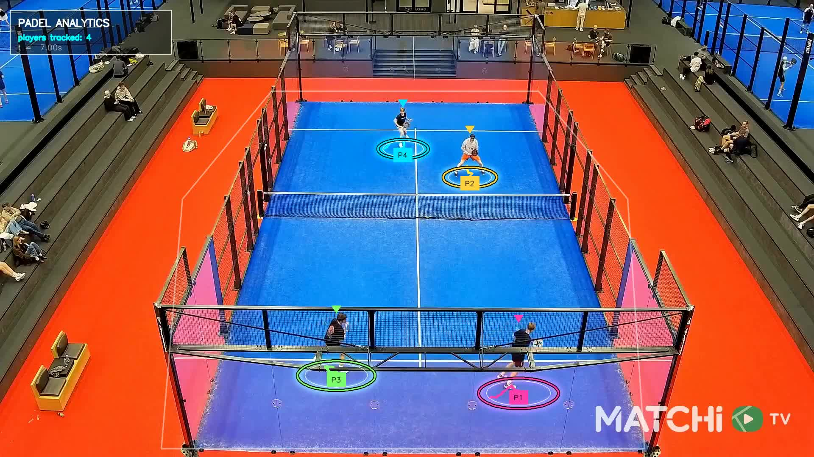
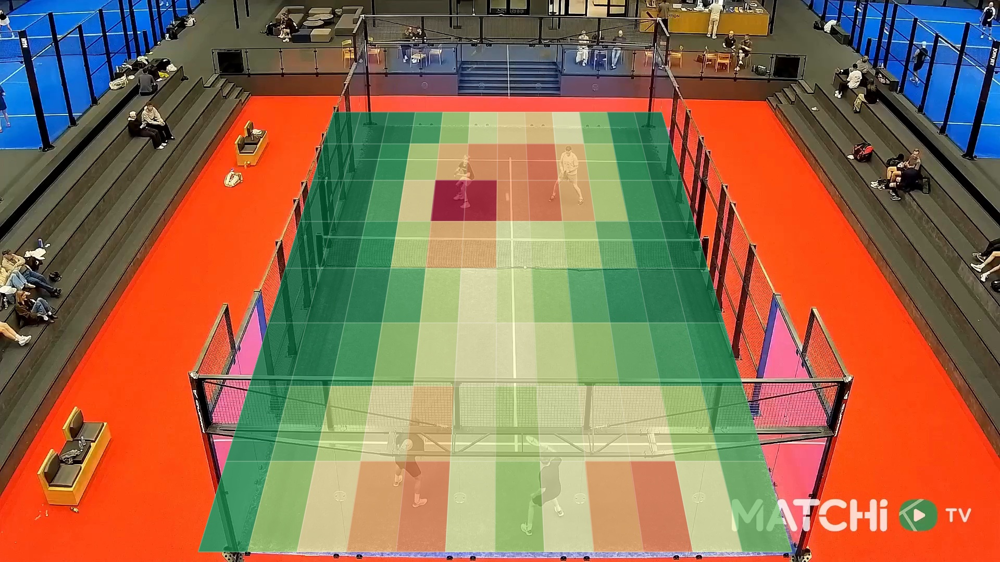

<div align="center">

# Padel Vision

**Computer-vision match analytics for padel: player detection, stable tracking, AR ground rings, foreground compositing, bird's-eye heatmaps, speed metrics, and notebook-style final video rendering.**

[](https://colab.research.google.com/drive/11_kHIpcG1kUcwtzs8svAx1b2xyfl-FP7?usp=sharing)
[](https://www.python.org/)
[](https://github.com/roboflow/rf-detr)
[](https://github.com/ifzhang/ByteTrack)
[](https://github.com/roboflow/supervision)
[](LICENSE)



</div>

---

## Overview

Padel Vision turns a raw match clip into a polished analytics video. It detects on-court
players, keeps player identities stable through rallies, projects AR rings onto the court,
composites players back in front of the graphics, and renders a final layout with a
bird's-eye court panel, movement heatmap, speed tags, and player stat cards.

The project started as a notebook-first prototype and now exposes the same workflow through
a reusable CLI. The most complete local path is:

```text
calibrate clip -> cache detections/mattes -> render final notebook-style video
```

## Visual Output

<div align="center">
  
  
</div>

The final renderer combines:

- AR ground rings under each tracked player.
- Foreground compositing so player pixels stay in front of graphics.
- Player labels and speed tags.
- A 2D court-map panel with trails and a heatmap grid.
- Distance, average speed, and work-rate stat cards.
- H.264 export for easy playback.

## Features

| Area | What it does |
| --- | --- |
| Detection | RF-DETR detects players; RF-DETR segmentation is used for the V2 notebook-style final cache. |
| Tracking | ByteTrack links detections across frames; custom stabilization smooths boxes and coasts through short misses. |
| Calibration | ROI, court corners, BEV point pairs, and a dedicated heatmap grid rectangle are saved per clip. |
| AR overlay | Perspective-projected ground rings are drawn under players with glow and per-player colors. |
| Compositing | Player mattes place real player pixels above rings and heatmaps. |
| Analytics | Bird's-eye map positions drive heatmaps, trails, distance, speed, and work-rate cards. |
| Rendering | The primary final render is direct OpenCV/Supervision video output matching the V2 notebook layout. |

## Install

Create an environment and install the package:

```bash
python3 -m venv .venv
source .venv/bin/activate

# Pick the Torch build that matches your CUDA setup.
pip install torch torchvision --index-url https://download.pytorch.org/whl/cu121

pip install -e ".[notebook,dev]"
```

For CPU-only experimentation:

```bash
pip install torch torchvision
pip install -e ".[notebook,dev]"
```

Interactive calibration windows use OpenCV, so local CLI workflows need a desktop display
such as WSLg, X11, or a normal Linux desktop session.

## Quickstart

Put a source clip here:

```text
data/raw/padel_clip.mp4
```

Then run the guided setup:

```bash
padel-vision guide data/raw/padel_clip.mp4
```

The guide walks through six steps:

1. Detection ROI: a polygon around the playable court area.
2. Court corners: TL, TR, BR, BL in the broadcast frame.
3. Bird's-eye-view pairs: matching points between the broadcast frame and the 2D court map.
4. Heatmap grid ROI: TL, TR, BR, BL on the 2D court map for the heatmap rectangle.
5. Detection cache: RF-DETR segmentation boxes and player mattes saved once.
6. Final render: direct OpenCV final video matching the V2 notebook layout.

The guide detects existing files and asks whether to reuse them, so it is safe to rerun while
tuning a clip.

## Required Inputs

| File | Purpose |
| --- | --- |
| `data/raw/<clip>.mp4` | Source match video. |
| `data/court_map.jpg` | Flat 2D court image used for the bird's-eye panel. |
| `data/calibration/<clip>.json` | ROI, court corners, and optional ring parameters. |
| `data/calibration/<clip>_bev_points.json` | BEV point pairs and `grid_map_quad` heatmap ROI. |
| `data/processed/detect_cache.pkl` | Cached V2 segmentation/tracking records for final rendering. |

The repository includes a padel map in `data/court_map.jpg`. For another sport or court,
replace that file before running the BEV and grid calibration steps.

## CLI Reference

### Guided Workflow

```bash
padel-vision guide data/raw/padel_clip.mp4
```

Useful options:

```bash
padel-vision guide data/raw/padel_clip.mp4 \
  --frame 300 \
  --court_map data/court_map.jpg \
  --stride 2 \
  --model nano \
  --conf 0.3
```

### Calibration Commands

Pick the detection ROI:

```bash
padel-vision roi adjust data/raw/padel_clip.mp4 --frame 300
```

Pick court corners in frame coordinates:

```bash
padel-vision court adjust data/raw/padel_clip.mp4 --frame 300
```

Tune AR ring parameters:

```bash
padel-vision court ring data/raw/padel_clip.mp4 --frame 300 --model nano
```

Pick BEV frame-to-map point pairs:

```bash
python scripts/pick_bev_points.py \
  --video data/raw/padel_clip.mp4 \
  --frame 300 \
  --map data/court_map.jpg \
  --out data/calibration/padel_clip_bev_points.json
```

Pick the heatmap grid rectangle on the 2D map:

```bash
python scripts/pick_grid_roi.py \
  --map data/court_map.jpg \
  --bev-json data/calibration/padel_clip_bev_points.json
```

### Preview Commands

Run live player detection:

```bash
padel-vision detect players data/raw/padel_clip.mp4 --model nano --stride 4
```

Run live tracking with AR rings:

```bash
padel-vision track players data/raw/padel_clip.mp4 --model nano --stride 2 --labels=True
```

Render a single heatmap preview frame:

```bash
padel-vision heatmap data/raw/padel_clip.mp4 --frame 300 --labels=True
```

### Final Notebook-Style Render

Build the detection cache once:

```bash
padel-vision final cache data/raw/padel_clip.mp4 \
  --output data/processed/detect_cache.pkl \
  --model nano \
  --stride 2 \
  --conf 0.3
```

Render the final cut:

```bash
padel-vision final render data/raw/padel_clip.mp4 \
  --cache data/processed/detect_cache.pkl \
  --bev_json data/calibration/padel_clip_bev_points.json \
  --court_map data/court_map.jpg \
  --output data/processed/padel_final.mp4
```

Add `--show=True` to display the render while it runs.

The renderer also writes a browser-friendly H.264 copy next to the output:

```text
data/processed/padel_final_h264.mp4
```

## Calibration Details

### Detection ROI

The ROI is the broad playable area in the original broadcast frame. It filters out spectators,
adjacent courts, and reflections. Save it with `padel-vision roi adjust`.

### Court Corners

Court corners are four frame points in this order:

```text
TL, TR, BR, BL
```

They are used for court-plane homography and player position normalization.

### BEV Point Pairs

BEV pairs connect points in the broadcast frame to the same points on the 2D court map.
Good points include court corners, service-line ends, net posts, and center-line junctions.
Use at least 6 to 10 well-spread pairs when possible.

### Heatmap Grid ROI

The heatmap grid is a separate 4-point rectangle on the 2D map:

```text
TL, TR, BR, BL
```

It is stored as `grid_map_quad` inside `data/calibration/<clip>_bev_points.json`.
This keeps the heatmap grid independent from the BEV matching points.

## Notebooks

| Notebook | Role |
| --- | --- |
| `notebooks/tutorials/padel_vision_v1.ipynb` | Original tutorial notebook and Colab-friendly workflow. |
| `notebooks/tutorials/padel_vision_v2.ipynb` | Broadcast-grade prototype for the final layout now mirrored by the CLI renderer. |

Open locally with:

```bash
jupyter lab notebooks/tutorials/padel_vision_v2.ipynb
```

Or use the Colab entry point:

[Open Padel Vision V1 in Colab](https://colab.research.google.com/drive/11_kHIpcG1kUcwtzs8svAx1b2xyfl-FP7?usp=sharing)

## Project Structure

```text
padel-vision/
├── assets/fonts/                 # Fonts used by the final overlay cards
├── config/default.yaml           # Detector defaults
├── data/
│   ├── raw/                      # Local input videos, ignored by git
│   ├── calibration/              # Per-clip calibration JSON, ignored by git
│   ├── processed/                # Rendered outputs and caches, ignored by git
│   └── court_map.jpg             # 2D court map
├── docs/                         # README media
├── notebooks/tutorials/          # V1/V2 notebook workflows
├── scripts/
│   ├── pick_bev_points.py        # Frame-to-map BEV calibration
│   ├── pick_grid_roi.py          # Heatmap grid ROI on the 2D map
│   └── guide_workflow.py         # Script wrapper around the CLI guide
├── src/padel_vision/
│   ├── cli.py                    # `padel-vision` command tree
│   ├── calibration.py            # Per-clip calibration store
│   ├── final_render.py           # Notebook-style final renderer
│   ├── workflow.py               # Guided interactive setup
│   ├── detect.py                 # Detection preview
│   ├── track.py                  # Tracking and AR preview
│   ├── heatmap.py                # Single-frame heatmap preview
│   ├── rings.py                  # AR ground-ring geometry
│   ├── court/
│   ├── detection/
│   └── video/
└── tests/
```

## Troubleshooting

### OpenCV window does not appear

Interactive pickers need a display. On WSL, make sure WSLg or an X server is available.
Headless terminals can still run cache/render commands after calibration exists.

### Qt font warnings appear

You may see OpenCV/Qt warnings such as:

```text
QFontDatabase: Cannot find font directory ...
```

They are usually harmless. The picker windows should still open and save calibration files.

### `grid_map_quad` is missing

Run:

```bash
python scripts/pick_grid_roi.py \
  --map data/court_map.jpg \
  --bev-json data/calibration/padel_clip_bev_points.json
```

Then rerun:

```bash
padel-vision final render data/raw/padel_clip.mp4
```

### Detection cache is stale

If you change ROI, court corners, detector settings, or the clip, rebuild the cache:

```bash
padel-vision final cache data/raw/padel_clip.mp4 --model nano --stride 2 --conf 0.3
```

### Final render uses the wrong map

Pass the map explicitly:

```bash
padel-vision final render data/raw/padel_clip.mp4 --court_map data/court_map.jpg
```

## Development

Run tests:

```bash
pytest -q
```

Run lint:

```bash
ruff check src tests scripts
```

Format code:

```bash
black src tests scripts
ruff check --fix src tests scripts
```

## Roadmap

- [x] Player detection
- [x] Court/ROI calibration
- [x] Stable player IDs
- [x] AR ground rings
- [x] Foreground compositing
- [x] Movement heatmap
- [x] Notebook-style final video renderer
- [x] CLI-guided calibration and rendering
- [ ] Ball detection and trajectory analytics
- [ ] Shot/event detection
- [ ] Tactical summaries
- [ ] Sport-specific court presets beyond padel
- [ ] Cleaner production pipeline for long-match processing

## Acknowledgements

This project builds on open-source tools from
[Roboflow](https://github.com/roboflow), [Ultralytics](https://github.com/ultralytics),
[Supervision](https://github.com/roboflow/supervision), and the ByteTrack community.

## License

[MIT](LICENSE) © 2026 Nassim
